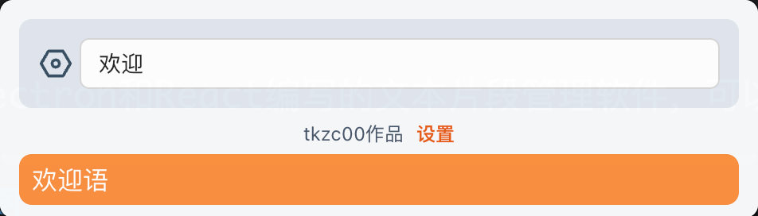
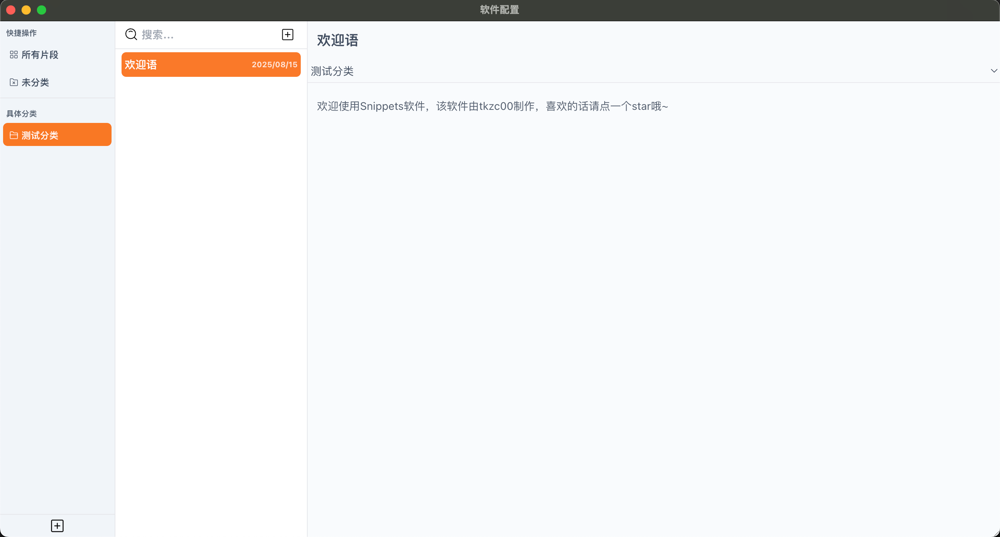
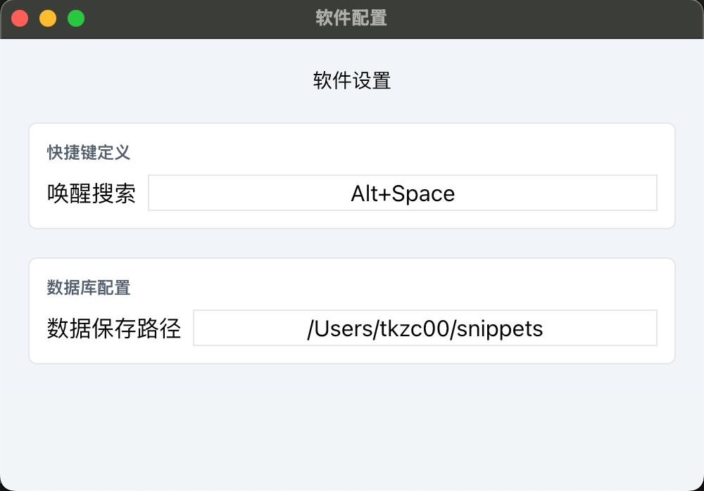

# snippets

一个由Electron和React编写的文本片段管理软件，可以在任意软件中使用

# 软件截图

## 主界面



## 数据配置界面



## 软件设置界面



## 项目初始化

### 安装

```bash
$ npm install
```

### 开发

```bash
$ npm run dev
```

### 编译

```bash
# For windows
$ npm run build:win

# For macOS
$ npm run build:mac

# For Linux
$ npm run build:linux
```
